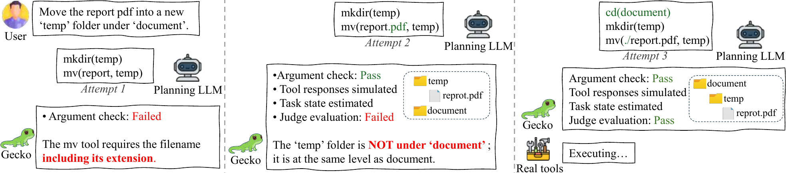

<h1 align="center">Gecko: A Simulation Environment with Stateful Feedback for Refining Agent Tool Calls</h1>

<div align="center">

[](https://arxiv.org/abs/2602.19218)
[](https://camel-ai.github.io/camel)
[](https://discord.camel-ai.org/)
[](https://x.com/CamelAIOrg)
[](https://github.com/camel-ai/camel)
[](https://www.camel-ai.org/)

</div>

<hr>

<div align="center">
<h4 align="center">

[Project Page](https://camel-ai.github.io/gecko/) |
[Paper](https://arxiv.org/abs/2602.19218) |
[Installation](#️-installation) |
[Citation](#️-cite) |
[CAMEL-AI](https://www.camel-ai.org/)

</h4>
</div>



## Abstract
The ability to use tools is fundamental for large language model (LLM) agents. Given a task, existing systems use LLMs to plan and generate tool calls, which are executed by real-world tools to complete the task. However, tool calls are prone to errors because they are derived merely from LLM intrinsic capabilities. What is more, while it is useful to let LLMs iteratively refine the tool-call sequence using execution results from real tools, this process can be expensive and lead to unsafe results.

To improve LLM tool calls and address issues caused by using real tools for refinement, we introduce Gecko, a comprehensive environment that simulates tool responses using a combination of rules and LLMs. Specifically, Gecko checks the validity of tool calls including input arguments and tool names, synthesizes reasonable responses that adhere to the output schema, and assesses whether all task objectives have been achieved. These three types of feedback provided by Gecko allow LLMs to refine their tool calls, forming a simple yet effective test-time scaling method named GATS. On BFCLv3 and $\tau^2$-bench, GATS consistently improves the tool-calling performance of various LLMs.

## Repository Structure

This repository contains both the **Gecko** simulation server and the **GATS** (Grounding Agent Test-time Scaling) execution engine:

```
gecko/          Gecko mock server (FastAPI, session management, LLM-based responses)
gats/           GATS engine (SimSolver wrapper, parallel runner, resume support)
inference/      Core inference (SimSolver, MockServerClient, agents)
benchmarks/     Benchmark plugins (BFCL)
data/           OpenAPI schemas and BFCL test data
scripts/        Tooling (Python-to-OpenAPI converter)
```

## Installation

### 1. Install
```bash
python -m venv .venv
source .venv/bin/activate
pip install -r requirements.txt
```

### 2. Configure env
```bash
cp .env.example .env
# then set OPENAI_API_KEY in .env
```

## Quick Start

### Start Gecko Server
```bash
python run_gecko_server.py --schemas_dir data/openapi --port 8000
```

Key parameters for `run_gecko_server.py`:
- `--schemas_dir`: OpenAPI schema root. Default: `data/openapi`.
- `--host`: Bind address. Default: `0.0.0.0`.
- `--port`: Service port. Default: `8000`.
- `--workers`: Uvicorn worker count. Default: `1`.
- `--response-model`: model used to generate mock responses. Default: `gpt-4.1-mini`.
- `--state-model`: model used for state updates. Default: `gpt-4.1-mini`.
- `--validation-model`: model used for request validation. Default: `gpt-4.1-mini`.

Example with explicit models and multiple workers:
```bash
python run_gecko_server.py \
  --schemas_dir data/openapi \
  --host 0.0.0.0 \
  --port 8000 \
  --workers 2 \
  --response-model gpt-4.1-mini \
  --state-model gpt-4.1-mini \
  --validation-model gpt-4.1-mini
```

### Run BFCL Single-Turn Tests

```bash
python run_bfcl_single.py --ids 0,1,2 --category simple_python --model gpt-4.1-mini
```

Key parameters for `run_bfcl_single.py`:
- `--category`: required BFCL single-turn category, such as `simple_python`, `live_multiple`, `parallel`.
- `--all` / `--ids` / `--ids-file` / `--pattern`: choose which tasks to run.
- `--limit`: cap selected task count.
- `--model`: agent model. Default: `gpt-4.1-mini`.
- `--workers`: parallel task workers. Default: `1`.
- `--max-retries`: retry budget per task. Default: `3`.
- `--target-score`: stop early when score reaches this threshold. Default: `1.0`.
- `--agent-timeout`: per-agent timeout in seconds. Default: `120`.
- `--agent-persistence`: keep agent history across retries.
- `--override-openapi-server`: force tool servers to Gecko URL. BFCL default is off.
- `--bfcl-eval` / `--no-bfcl-eval`: run official BFCL evaluation after inference. Default: on.
- `--output-dir`: result directory. Default: `results`.
- `--resume`: reuse partial results from `.resume/`.
- `--debug`, `--verbose`: increase log detail.

Example full run:
```bash
python run_bfcl_single.py \
  --all \
  --category simple_python \
  --model gpt-4.1-mini \
  --workers 4 \
  --max-retries 3 \
  --resume
```

### Run BFCL Multi-Turn Tests

```bash
python run_bfcl_multi.py --ids 0,1 --category multi_turn_base --model gpt-4.1-mini
```

Key parameters for `run_bfcl_multi.py`:
- `--category`: multi-turn category. Default: `multi_turn_base`.
- `--all` / `--ids` / `--ids-file` / `--pattern`: choose tasks.
- `--limit`, `--model`, `--workers`, `--max-retries`, `--target-score`, `--agent-timeout`, `--agent-persistence`: same meaning as single-turn.
- `--no-checklist`: disable dynamic checklist generation.
- `--override-openapi-server`: same behavior as single-turn.
- `--bfcl-eval`, `--output-dir`, `--resume`, `--debug`, `--verbose`: same behavior as single-turn.

Example:
```bash
python run_bfcl_multi.py \
  --all \
  --category multi_turn_base \
  --model gpt-4.1-mini \
  --workers 2 \
  --max-retries 3
```

### Evaluate Saved BFCL Results

```bash
python bfcl_evaluate.py --result-dir results --test-category all
```

Key parameters for `bfcl_evaluate.py`:
- `--model`: one or more model names to evaluate. If omitted, inferred from filenames.
- `--test-category`: category group or specific category, such as `all`, `single_turn`, `multi_turn`, `live`, `simple_python`.
- `--result-dir`: root results directory or a specific model subdirectory.
- `--file`: evaluate a single result file directly; overrides directory/category selection.

### Gecko API Endpoints
- `GET /session-id` — create a new session
- `POST /set-session-state` — set initial or current state
- `GET /get-session-state` — fetch latest state
- `GET /get-session-history` — fetch request/response history
- `POST /update-state-from-real` — sync real tool results into state

Both `POST /api_name/endpoint` and `POST /endpoint` route styles are supported.

## Cite
If you find this repo useful, please cite:

```bibtex
@misc{zhang2026gecko,
      title={Gecko: A Simulation Environment with Stateful Feedback for Refining Agent Tool Calls},
      author={Zeyu Zhang and Guohao Li and Zhenchang Xing and Alexandros Apostolopoulos and Yu Lin Lee and Liang Zheng},
      year={2026},
      eprint={2602.19218},
      archivePrefix={arXiv},
      url={https://arxiv.org/abs/2602.19218},
}
```
