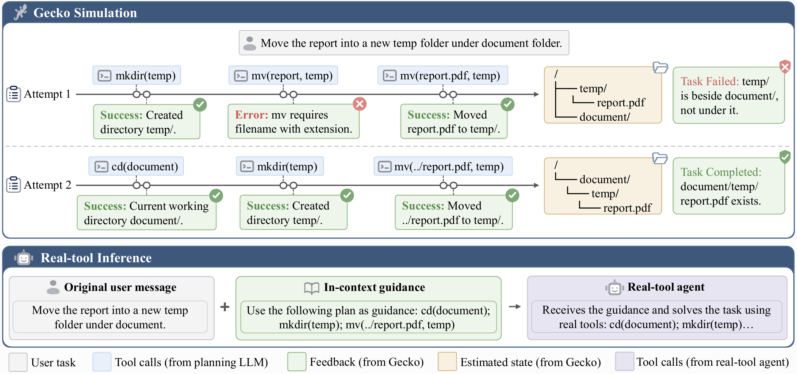

<h1 align="center">Gecko: A Simulation Environment with Stateful Feedback for Refining Agent Tool Calls</h1>

<div align="center">

[](https://arxiv.org/abs/2602.19218)
[](https://camel-ai.github.io/camel)
[](https://discord.camel-ai.org/)
[](https://x.com/CamelAIOrg)
[](https://github.com/camel-ai/camel)
[](https://www.camel-ai.org/)

</div>

<hr>

<div align="center">
<h4 align="center">

[Project Page](https://camel-ai.github.io/gecko/) |
[Paper](https://arxiv.org/abs/2602.19218) |
[Installation](#installation) |
[Third-Party Notices](#third-party-benchmarks-and-data) |
[Citation](#cite) |
[CAMEL-AI](https://www.camel-ai.org/)

</h4>
</div>

<p align="center">
  
</p>

## Abstract
The ability to use tools is fundamental for large language model (LLM) agents. Given a task, existing systems use LLMs to plan and generate tool calls, which are executed by real-world tools to complete the task. However, tool calls are prone to errors because they are generated primarily from the intrinsic capabilities of LLMs. Moreover, while it is useful to let LLMs iteratively refine the tool-call sequence using execution results from real tools, this process can be expensive and may cause unsafe side effects. To improve LLM tool calls and address issues caused by using real tools for refinement, we introduce Gecko, a stateful simulation environment that provides informative feedback for refining LLM tool calls before real execution. Specifically, Gecko combines rules and LLMs to check the validity of tool names and arguments, synthesize schema-conforming and state-consistent responses, and judge task completion against the user objective. These three types of feedback allow LLMs to refine their tool calls in simulation, forming a simple yet effective test-time scaling method named GATS. On BFCLv3 and $\tau^2$-bench, GATS consistently improves the tool-calling performance of various LLMs.

## Repository Structure

This repository contains both the **Gecko** simulation server and the **GATS** (Grounding Agent Test-time Scaling) execution engine. BFCL and tau-bench are first-class benchmark integrations in this repo. The main entry points live at the repository root:

```
run_gecko_server.py   Start the Gecko mock server
run_bfcl_single.py    Run BFCL single-turn evaluations
run_bfcl_multi.py     Run BFCL multi-turn evaluations
run_taubench.py       Run the in-repo tau-bench airline/retail runtime
```

Core directories:

```
gecko/       Gecko mock server (FastAPI, sessions, validation, responses, state updates)
gats/        GATS orchestration around simulation attempts, benchmark tasks, and real execution
inference/   Core execution engine, agents, checklist/judge coordination, real-tool bridge
benchmarks/  BFCL and tau-bench loaders, runtimes, adapters, and evaluators
data/        Local BFCL/tau-bench data and OpenAPI schemas
utils/       Shared utilities, model aliases, preflight checks, and OpenAPI fixes
scripts/     CAMEL OpenAPI toolkit patch helper
```

## Installation

### 1. Create an environment

Python 3.10 through 3.14 is required. Use an isolated conda environment; reusing `base` or another benchmark environment can leave incompatible transitive dependencies installed. The actively used local conda environment is named `camel`.

```bash
conda create -n camel python=3.10
conda activate camel
```

### 2. Install dependencies and patched CAMEL

Gecko requires CAMEL from source with this repository's patched OpenAPI toolkit. Installing only the PyPI `camel-ai` package is not sufficient.

Install the non-CAMEL repository dependencies first:

```bash
pip install -r requirements.txt
```

Then install CAMEL from source in the same activated environment. The CAMEL repository can live anywhere on disk, but the editable install must be registered in the `camel` conda env. Use your own fork if needed; the upstream repository is <https://github.com/camel-ai/camel>. If a PyPI `camel-ai` package is already installed in the environment, remove it first.

```bash
pip uninstall -y camel-ai

git clone https://github.com/camel-ai/camel.git ../camel
cd ../camel
pip install -e ".[all]"

cd ../gecko
```

Manually replace CAMEL's OpenAPI toolkit with the patched file from this repository:

```bash
cp scripts/open_api_toolkit.py /path/to/camel/camel/toolkits/open_api_toolkit.py
```

For example, if your editable CAMEL checkout is `../camel`:

```bash
cp scripts/open_api_toolkit.py ../camel/camel/toolkits/open_api_toolkit.py
```

### 3. Configure model credentials

Runtime entry points load `.env` from the repository root automatically.

```bash
cp .env.example .env
```

Set the provider keys you plan to use:

```bash
OPENAI_API_KEY=...
```

Model aliases are configured in `utils/model_utils.py`.

## Quick Start

### Start Gecko Server

Use BFCL schemas with state updates disabled for BFCL single-turn runs:

```bash
python run_gecko_server.py \
  --schemas-dir data/bfcl/openapi/single_turn \
  --port 8000 \
  --workers 12 \
  --response-model gpt-5.5 \
  --state-model none \
  --validation-model gpt-5.5
```

For BFCL multi-turn runs, use the multi-turn schema directory and keep `--state-model` enabled:

```bash
python run_gecko_server.py \
  --schemas-dir data/bfcl/openapi/multi_turn \
  --port 8000 \
  --workers 12 \
  --response-model gpt-5.5 \
  --state-model gpt-5.5 \
  --validation-model gpt-5.5
```

Use tau-bench mock schemas for tau-bench GATS runs:

```bash
python run_gecko_server.py \
  --schemas-dir data/taubench/openapi/mock \
  --port 8000 \
  --workers 12 \
  --response-model gpt-5.5 \
  --state-model gpt-5.5 \
  --validation-model gpt-5.5
```

Key parameters for `run_gecko_server.py`:

- `--schemas-dir` / `--schemas_dir`: OpenAPI schema root. Use `data/bfcl/openapi/single_turn` for BFCL single-turn, `data/bfcl/openapi/multi_turn` for BFCL multi-turn, and `data/taubench/openapi/mock` for tau-bench.
- `--host`: bind address. Default: `0.0.0.0`.
- `--port`: service port. Default: `8000`.
- `--workers`: worker process count. Default: `15`.
- `--response-model`: model used to generate mock responses. Default: `gpt-5.5`.
- `--state-model`: model used for state updates. BFCL single-turn requires `none`; BFCL multi-turn and tau-bench GATS runs normally keep this enabled.
- `--validation-model`: model used for LLM semantic request validation. BFCL single-turn should match the tested model; deterministic schema/type validation also runs.

Health check:

```bash
curl -s http://localhost:8000/health
```

### Run BFCL Single-Turn Tests

Start Gecko with `data/bfcl/openapi/single_turn`, `--state-model none`, and `--validation-model` set to the same model as `run_bfcl_single.py --model` before running BFCL single-turn. The runner fails fast if Gecko reports an enabled state model or a mismatched validation model.

```bash
python run_bfcl_single.py --ids 0,1,2 --category simple_python --model gpt-5.5
```

Key parameters for `run_bfcl_single.py`:
- `--category`: required BFCL single-turn category, such as `simple_python`, `live_multiple`, `parallel`. Use `--category all` to run the 7 supported single-turn categories (`simple_python`, `multiple`, `parallel`, `irrelevance`, `live_simple`, `live_multiple`, `live_irrelevance`) as separate result files.
- `--all` / `--ids` / `--ids-file`: choose which tasks to run.
- `--num-tasks`: cap selected task count.
- `--model`: agent model.
- `--workers`: parallel task workers.
- `--max-retries`: retry budget per task.

Example full run:
```bash
python run_bfcl_single.py \
  --all \
  --category simple_python \
  --model gpt-5.5 \
  --workers 10 \
  --max-retries 2 \
  --resume
```

Core single-turn sweep:
```bash
python run_bfcl_single.py --category all --model gpt-5.5 --workers 10
```

### Run BFCL Multi-Turn Tests

Start Gecko with `data/bfcl/openapi/multi_turn` and an enabled `--state-model` before running BFCL multi-turn.

```bash
python run_bfcl_multi.py --ids 0,1 --category multi_turn_base --model gpt-5.5
```

Key parameters for `run_bfcl_multi.py`:
- `--category`: multi-turn category. Default: `multi_turn_base`.
- `--all` / `--ids` / `--ids-file`: choose tasks.
- `--num-tasks`, `--model`, `--workers`, `--max-retries`: same meaning as single-turn.
- `--output-dir`, `--resume`, `--debug`, `--verbose`: same behavior as single-turn.
- Multi-turn BFCL always uses dynamic checklist generation and always runs official evaluation after inference.

Example:
```bash
python run_bfcl_multi.py \
  --all \
  --category multi_turn_base \
  --model gpt-5.5 \
  --workers 10 \
  --max-retries 2
```

### Run tau-bench Tests

Start Gecko with `data/taubench/openapi/mock` before running tau-bench.

GATS hybrid run:

```bash
python run_taubench.py \
  --domain airline \
  --task-ids 0,1,2 \
  --agent-llm gpt-5.5 \
  --user-llm gpt-5.5 \
  --judge-llm gpt-5.5 \
  --num-trials 1 \
  --workers 10 \
  --gats-retries 2 \
  --gecko-url http://localhost:8000 \
  --debug
```

Key parameters for `run_taubench.py`:

- `--domain`: `airline` or `retail`.
- `--task-ids` / `--num-tasks`: choose tasks.
- `--agent-llm`: tested assistant model.
- `--user-llm`: tau-bench user simulator model.
- `--judge-llm`: natural-language assertion judge model. Defaults to `--agent-llm`.
- `--num-trials`: trials per selected task. Default: `1`.
- `--seed`: base seed. Default: `300`.
- `--workers`: parallel task workers.
- `--gats-retries`: retry budget for GATS simulation attempts. Current tau-bench default is `2`.
- `--agent-timeout`: per-agent and Gecko mock-tool timeout in seconds. Default: `360`.
- `--debug`: enable debug-level logging.

tau-bench outputs are written to `results/taubench/<timestamp>_<domain>_<models>_<mode>/`:

- `summary.json`: compact run summary and per-task rows.
- `results.json`: official-compatible simulation bundle.

### Evaluate Saved BFCL Results

```bash
python -m benchmarks.bfcl.evaluate --result-dir results --test-category all
```

Key parameters for `python -m benchmarks.bfcl.evaluate`:

- `--model`: one or more model names to evaluate. If omitted, inferred from filenames.
- `--test-category`: category group or specific category, such as `all`, `single_turn`, `multi_turn`, `live`, `simple_python`.
- `--result-dir`: root results directory or a specific model subdirectory.
- `--file`: evaluate a single result file directly; overrides directory/category selection.

### Gecko API Endpoints
- `GET /session-id` — create a new session
- `POST /set-session-state` — set initial or current state
- `POST /init-session-state` — initialize a session from schema defaults and provided state
- `GET /get-session-state` — fetch latest state
- `POST /update-state-from-real` — sync real tool results into state

## Third-Party Benchmarks and Data

This repository includes adapted benchmark code, data, schemas, and evaluation
helpers from BFCL and tau-bench/tau2-bench:

- BFCL is from the UC Berkeley Gorilla project and is licensed under Apache-2.0.
- tau-bench/tau2-bench is from Sierra Research and is licensed under MIT.

See [THIRD_PARTY_NOTICES.md](THIRD_PARTY_NOTICES.md) for upstream links,
license notices, local scope, and benchmark citations.

## Cite
If you find this work useful, please cite:

```bibtex
@misc{zhang2026gecko,
      title={Gecko: A Simulation Environment with Stateful Feedback for Refining Agent Tool Calls},
      author={Zeyu Zhang and Guohao Li and Zhenchang Xing and Alexandros Apostolopoulos and Yu Lin Lee and Liang Zheng},
      year={2026},
      eprint={2602.19218},
      archivePrefix={arXiv},
      url={https://arxiv.org/abs/2602.19218},
}
```
